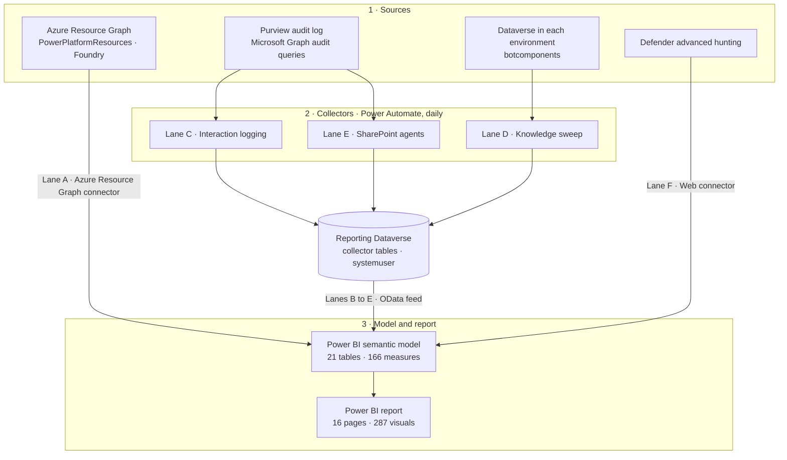

# Custom Agent Reporting – Architecture

A community reference architecture for **tenant-wide reporting on AI agents** across Microsoft Copilot Studio, Microsoft 365 Copilot Agent Builder, SharePoint agents and Microsoft Foundry (formerly Azure AI Foundry), built with Power BI, Azure Resource Graph, Dataverse, the Microsoft Purview audit log and Microsoft Defender.

**Read the full guide: <https://ryanbowie.github.io/custom-agent-reporting-architecture/>**

> [!IMPORTANT]
> **This is not a replacement for Microsoft Agent 365.**
>
> - A custom build like this has to be designed, secured, run and maintained by your own organisation. Agent 365 is delivered and maintained by Microsoft as a service.
> - This build only does **reporting**. Agent 365 goes well beyond reporting, into areas such as the agent registry, access control and security. See the [Agent 365 overview](https://learn.microsoft.com/microsoft-agent-365/overview).
> - If you have Agent 365, its registry and APIs are the better inventory source. Start there.
>
> This repository exists to show what is possible with a custom solution, not to recommend one over a Microsoft service.

## What's in this repository

| Path | Contents |
|---|---|
| `docs/index.html` | The guide, published with GitHub Pages: architecture, data lanes, collectors, gateway-free refresh, semantic model, origin and risk scoring, coverage, findings, Shadow AI, permissions and limitations |
| `docs/assets/` | Six screenshots of the working report |

**Documentation only.** The Power BI report file, the semantic model and the code that generates them are **not** published. The guide describes the design in enough detail to build your own.

## Screenshots

Six of the 16 report pages from a working build. Names are fictitious and figures are indicative only.

| | |
|---|---|
|  **Executive overview**: the whole estate on one page, sliced by origin, platform, environment and risk. |  **Agent inventory**: a register with creator, owner, environment, orchestration, model, authentication and risk band. |
|  **Copilot interactions**: per-agent usage from the audit log, including autonomous runs and SharePoint agents. |  **Governance and risk**: sharing, unauthenticated agents, quarantine and an explainable risk score. |
|  **Knowledge sources**: SharePoint sites, websites, Dataverse tables, Graph connectors and Azure AI Search indexes. |  **Azure AI Foundry** (now Microsoft Foundry): regions, SKUs and public network exposure. |

## Architecture at a glance

| Lane | Collects | How |
|---|---|---|
| A | Agent inventory: Copilot Studio and Agent Builder agents, Foundry projects, agent flows, environments | Power BI queries Azure Resource Graph at refresh |
| B | Creator and owner names | Dataverse `systemuser` at refresh |
| C | Per-turn interaction telemetry from the Purview audit log | Daily collector flow |
| D | Named knowledge sources for each agent | Daily sweep of every environment |
| E | SharePoint agent (`.agent` file) inventory | Daily collector flow |
| F | Unsanctioned AI tools on managed devices | Defender advanced hunting at refresh |

- **Read-only.** It never changes an agent. The only writes are the collectors' rows in your own Dataverse.
- **No gateway.** Scheduled refresh runs entirely in the Power BI service, using three connectors.
- **Data first.** The report pages were designed around what the APIs actually return, and the guide records what was learned along the way.

## Related

- [Copilot Interaction Logging](https://github.com/RyanBowie/copilot-interaction-logging): the lane C collector, documented separately as a build guide with no package to install. It covers every action in both flows and why it exists, the secret-handling decision and the environment variables.
- [Microsoft Agent 365 overview](https://learn.microsoft.com/microsoft-agent-365/overview).

## Licence and disclaimer

Released under the [MIT licence](LICENSE).

This is an independent community project. It isn't a Microsoft product and isn't supported by Microsoft. The content is provided "as is", without warranty of any kind. Test any design in a non-production tenant first, and review it with your security and compliance teams.

Microsoft, Microsoft 365, Copilot, Copilot Studio, Power BI, Power Automate, Power Platform, Dataverse, Azure, Microsoft Entra, Microsoft Purview, Microsoft Defender, Microsoft Foundry and SharePoint are trademarks of the Microsoft group of companies.
